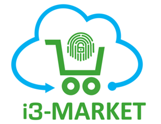

 # Welcome to the i3-MARKET Backplane
 

### A Free Open Source Software Platform for SMEs, Developers and Large Industries Building/Enhancing their Data Marketplaces.
### www.open-source.i3-market.eu

#### Intelligent, Interoperable, Integrative and deployable open source MARKETplace backplane Tools for easy deployment of DaaS and a platform to support online data marketplaces.

## i3-MARKET Backplane Platform – Short Description

Data is changing the way people understand society, Data is mobilising all industry sectors to be more competitive, productive and aware of technological problems, every day more Data is available directly from the sources i.e. sensors, smart devices, manufacturing systems, etc. The Data has an estimated value considering the different characteristics and also the purpose for which the data is collected for, this large amount of Data has an inherent value which has been for long time unexploited or in hand of intermediaries.

The i3-MARKET project is a consortium of 14 partners from large industries and system integrators to and research organisations, We are a onboarding i3-MARKET experts, (from coordination to technical partners) that bring the know-how and the expertise in building the solution based on high quality standards and impact in developers and SME communities. i3-MARKET addresses the challenge of integration following design and OSS implementation best practices, interoperable by using graph and semantic models that defines a common conceptual framework and information model that enables cross domain data exchange and sharing, intelligent from the perspective of smart contracts generations automatically and associate those financial operations into a set of tools that facilitate that data assets can be commercialised cross-domain and intra-domain almost transparently in a secure and protected digital markets environment. The i3-MARKET consortium introduces its software platform, as a solution to the big challenge of enabling the coexistence of dataspaces with marketplaces for enlarging the European Digital Market Ecosystem.

The i3-MARKET project has built a blueprint open source software architecture called “i3-MARKET Backplane” (www.open-source.i3-market.eu) that addresses the growing demand for connecting multiple data spaces and marketplaces in a secure and federated manner. i3-MARKET consortium is contributing with the developed software tools to build the European Data Market Economy by innovating marketplace platforms, demonstrating with three industrial reference implementations (pilots) that a decentralised data economy and more fair growth is possible.

